# 唯美森系水彩晕染小鹿PPT模板

- Source: `唯美森系水彩晕染小鹿PPT模板.pptx`
- Total slides: 28

## Slide 1

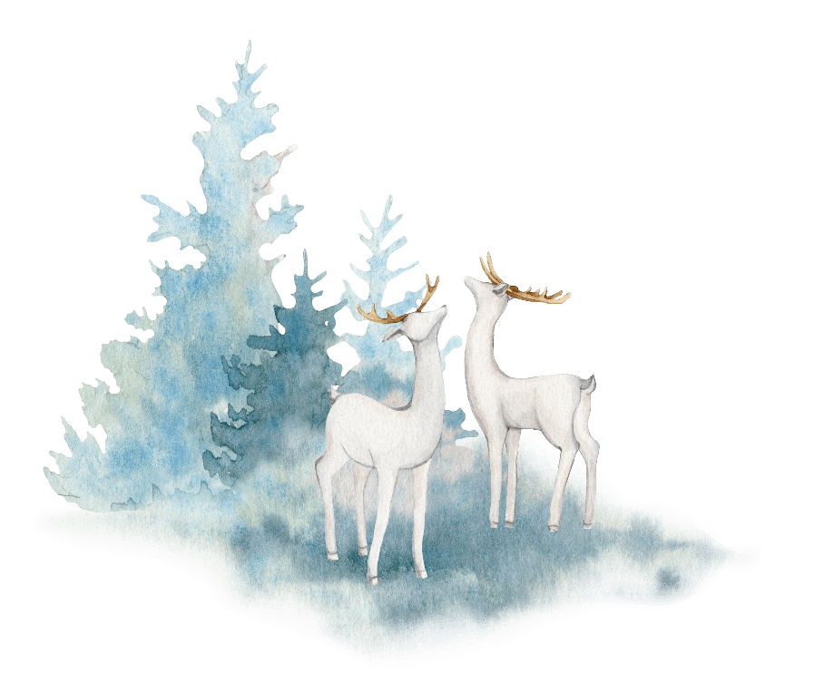

森系水彩

于时光深处，一分喜欢，一分冷暖，心思渐渐入了沧海

教育培训PPT模板

## Slide 2

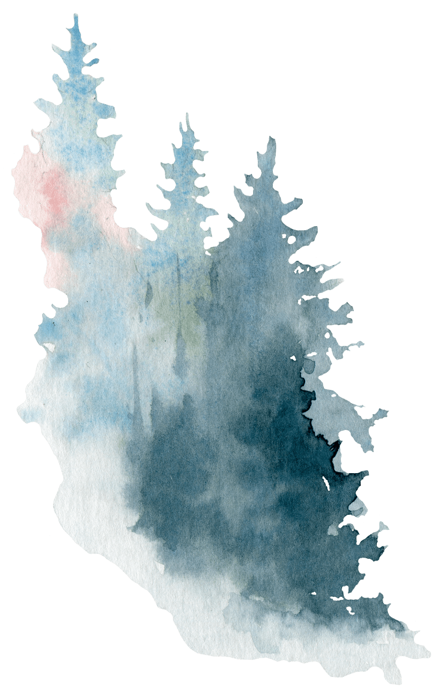

目录

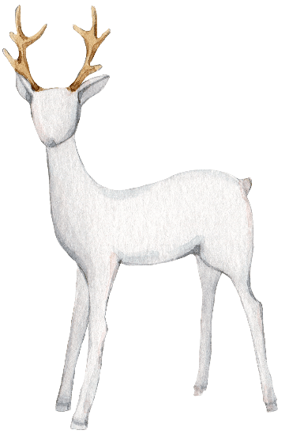

于时光深处，一分喜欢，

一分冷暖，心思渐渐入了沧海

于时光深处，一分喜欢，

一分冷暖，心思渐渐入了沧海

## Slide 3

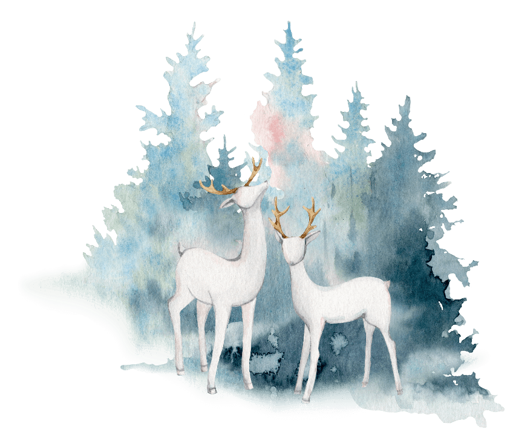

第一部分

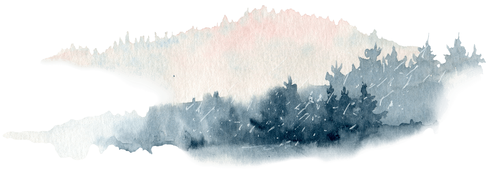

于时光深处，一分喜欢，一分冷暖，心思渐渐入了沧海

## Slide 4

https://www.ypppt.com/

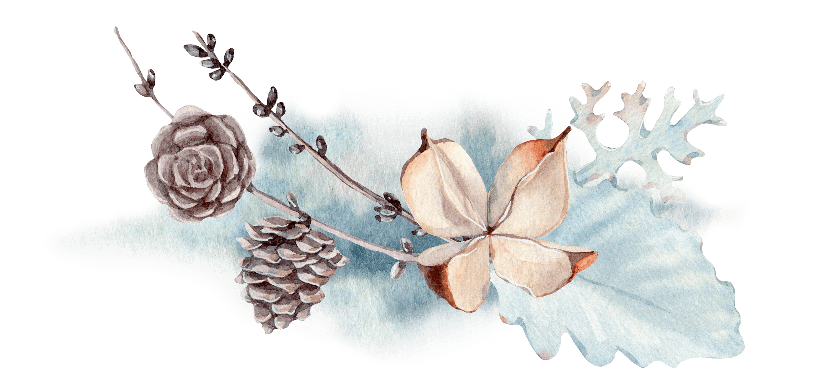

- title
- content

- If you haven’t found the public domain images you were looking for at public domain archive.
- Free images and videos you can use anywhere.

## Slide 5

- Input
- the
- title content

YOUR TITLE HERE

- I decided to make A list of some of my favorite sites for free stock photos.
- If you haven’t found the public domain images you were looking for at public domain archive.
- Free images and videos you can use anywhere.
- All images and videos on Pixabay

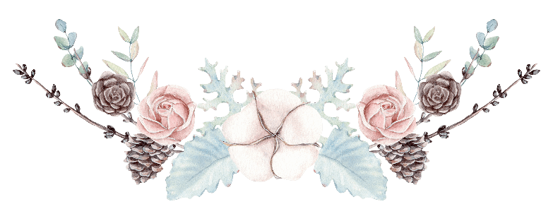

- As a web designer,
- I am always looking for awesome photos to include in my designs and mockups.

### Speaker Notes

https://www.ypppt.com/

## Slide 6

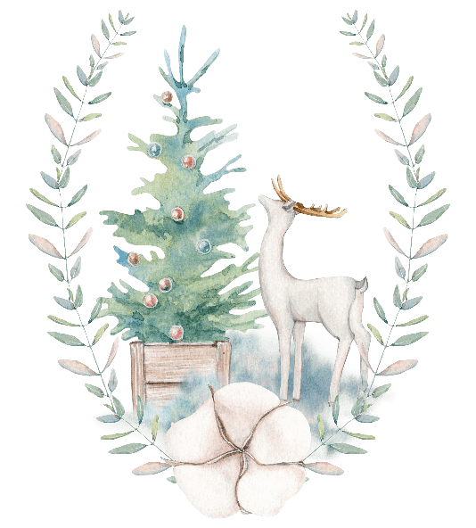

- Input
- the
- title content

Title content

- I decided to make
- A list of some of my favorite sites for free stock photos.
- If you haven’t found the public domain images you were looking for at public domain archive

- Although, you’re more than welcome to let me know if you use images for a website.
- Free images and videos you can use anywhere. All images and videos on Pixabay

## Slide 7

- Input
- The Content

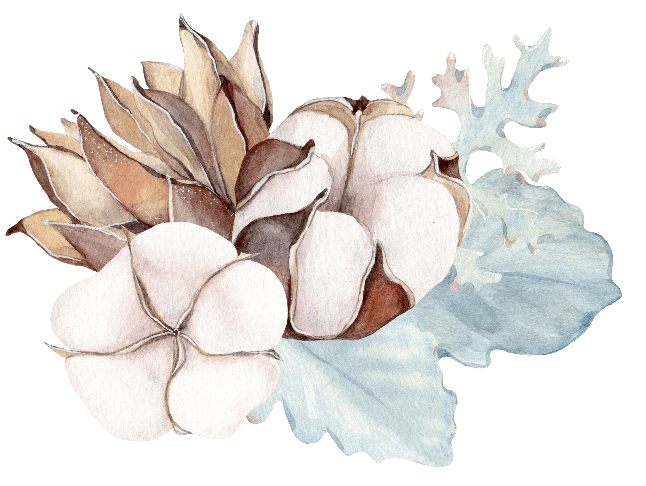

I decided to make a list of some of my favorite sites for free stock photos. If you haven’t found the public domain images you were looking for at Public Domain Archive. Although, you’re more than welcome to let me know if you use images for a website

YOUR TITLE

Under the blue below the template input title

YOUR TITLE

Under the blue below the template input title

## Slide 8

TITLE HERE

Although, you’re more than welcome to let me know if you use images for a website

- TITLE
- CONTENT

Although, you’re more than welcome to let me know if you use images for a website. Free images and videos you can use anywhere. All images and videos on Pixabay.

TITLE HERE

Free images and videos you can use anywhere. All images and videos on Pixabay

TITLE HERE

Although, you’re more than welcome to let me know if you use images for a website

## Slide 9

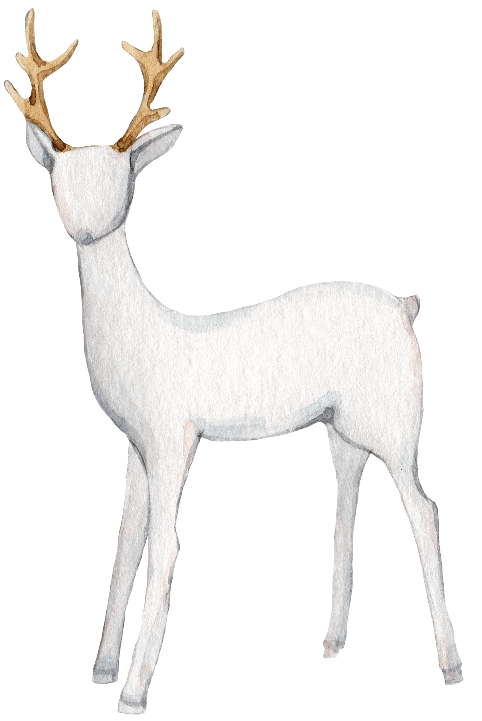

第二部分

于时光深处，一分喜欢，一分冷暖，心思渐渐入了沧海

## Slide 10

于时光深处，一分喜欢，

01

02

03

04

TITLE

TITLE

TITLE

TITLE

Free images and videos you can use anywhere.

- If you haven’t found the public domain images
- you were looking

Under the blue below the template input title

Although, you’re more than welcome to let me know if you use images

## Slide 11

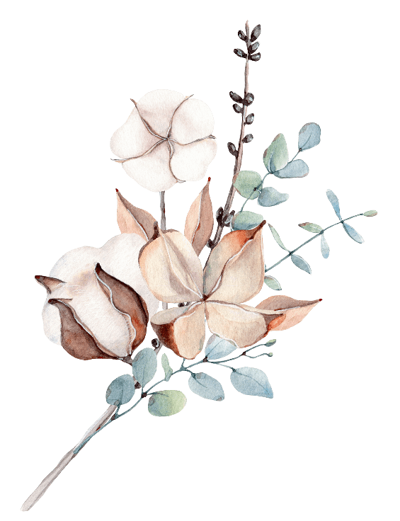

TITLE

TITLE

blue below the template

blue below the template

TITLE

TITLE

I decided to make a list of some of my favorite sites for free stock photos. If you haven’t found the public domain images you were looking for at Public Domain Archive

blue below the template

blue below the template

## Slide 12

YOUR TITLE

- I decided to make
- A list of some of my favorite sites for free stock photos.
- If you haven’t found the public domain images you were looking for at public domain archive
- Free images and videos you can use anywhere. All images and videos on Pixabay

Free images and videos you can use anywhere. All images and videos on Pixabay

YOUR TITLE

Free images and videos you can use anywhere. All images and videos on Pixabay

- The
- title content

YOUR TITLE

Free images and videos you can use anywhere. All images and videos on Pixabay

## Slide 13

Title content

Under the blue below the template input title

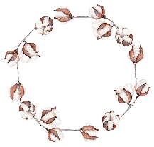

The title content

The title content

The title content

The title content

Although, you’re more than welcome to let me know if you use images for a website

Although, you’re more than welcome to let me know if you use images for a website

Although, you’re more than welcome to let me know if you use images for a website

Although, you’re more than welcome to let me know if you use images for a website

## Slide 14

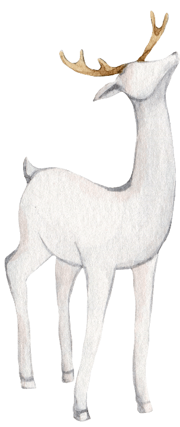

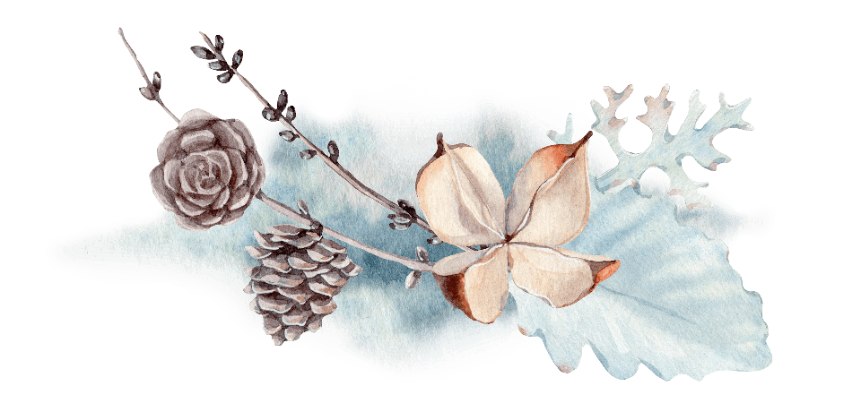

第三部分

于时光深处，一分喜欢，一分冷暖，心思渐渐入了沧海

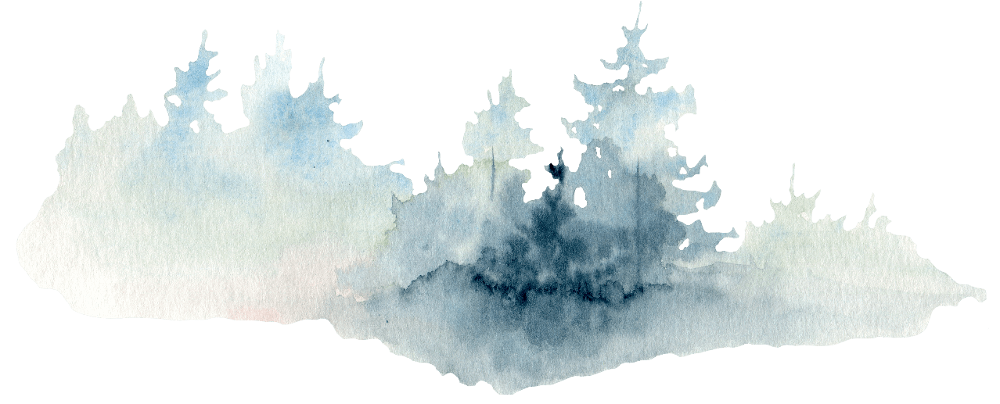

## Slide 15

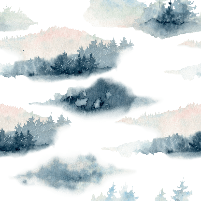

TITLE HERE

- I decided to make
- A list of some of my favorite sites for free stock photos.
- If you haven’t found the public domain images you were looking for at public domain archive
- Free images and videos you can use anywhere. All images and videos on Pixabay

Although, you’re more than welcome to let me know if you use images for a website

TITLE HERE

As a web designer, I am always looking for awesome photos to include in my designs and mockups.

TITLE HERE

Free images and videos you can use anywhere. All images and videos on Pixabay

## Slide 16

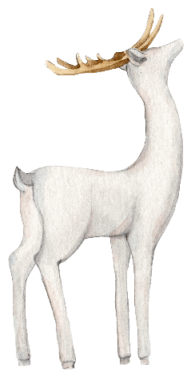

The title content

Under the blue below the template input title

- If you haven’t found
- the public domain images you were looking for at public domain archive
- Free images and videos you can use anywhere.
- All images and videos on Pixabay

- I decided to make
- A list of some of my favorite sites for free stock photos. Free images and videos you can use anywhere. All images and videos on Pixabay

## Slide 17

Title content

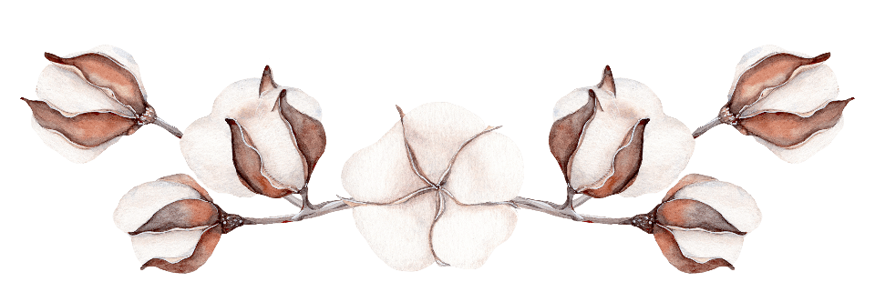

As a web designer, I am always looking for awesome photos to include in my designs and mockups. I hate buying stock photos just to use them once.

TITLE HERE

TITLE HERE

TITLE HERE

TITLE HERE

Although, you’re more than welcome to let me know if you use images for a website

As a web designer, I am always looking for awesome photos to include in my designs and mockups.

Free images and videos you can use anywhere. All images and videos on Pixabay

Although, you’re more than welcome to let me know if you use images for a website

## Slide 18

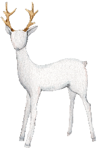

THE TITLE

THE TITLE

THE TITLE

Although, you’re more than welcome to let me know if you use images for a website

If you haven’t found the public domain images you were looking for at Public Domain Archive

Free images and videos you can use anywhere. All images and videos on Pixabay

## Slide 19

YOUR TITLE HERE

- I decided to make A list of some of my favorite sites for free stock photos.
- If you haven’t found the public domain images you were looking for at public domain archive.

01

02

03

04

TITLE HERE

TITLE HERE

TITLE HERE

TITLE HERE

As a web designer, I am always looking for awesome photos to include in my designs and mockups.

- I decided to make
- A list of some of my favorite sites for free stock photos.

Although, you’re more than welcome to let me know if you use images for a website

Free images and videos you can use anywhere. All images and videos on Pixabay

## Slide 20

Title content

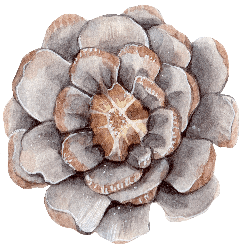

The title content

I decided to make a list of some of my favorite sites for free stock photos. If you haven’t found the public domain images you were looking for at Public Domain Archive

## Slide 21

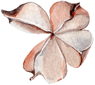

The title content

Although, you’re more than welcome to let me know if you use images for a website

The title content

Although, you’re more than welcome to let me know if you use images for a website

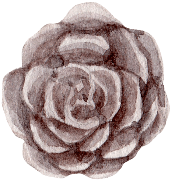

The title content

Although, you’re more than welcome to let me know if you use images for a website

## Slide 22

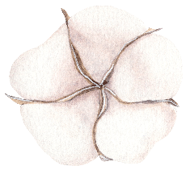

The title content

Although, you’re more than welcome to let me know if you use images for a website

Title content

Under the blue below the template input title

## Slide 23

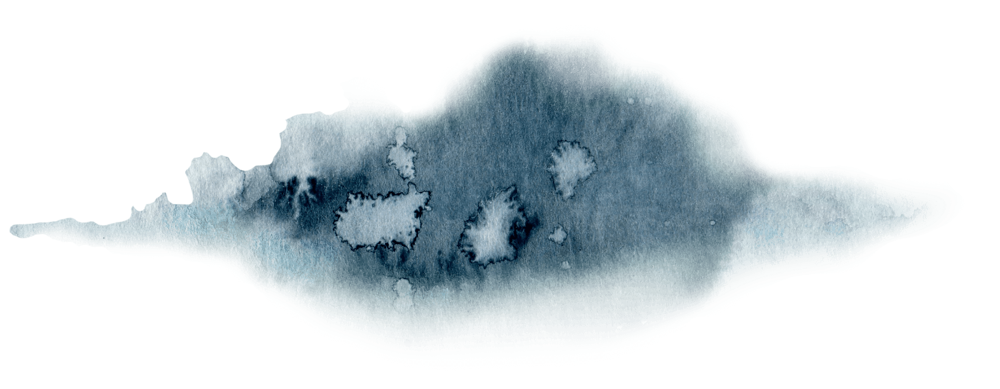

第四部分

于时光深处，一分喜欢，一分冷暖，心思渐渐入了沧海

## Slide 24

- INPUT
- TITLE CONTENT

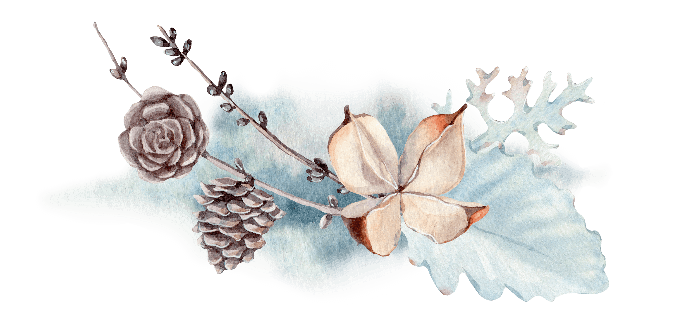

- A list of some of my favorite
- sites for free stock photos.
- If you haven’t found the public domain images you were looking for at public domain archive

## Slide 25

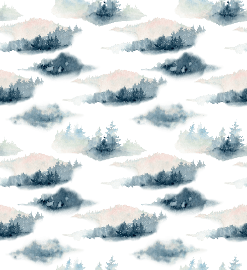

- Input
- the content

Title content

If you haven’t found the public domain images you were looking for at Public Domain Archive. Under the blue below the template input title.

As a web designer, I am always looking for awesome photos to include in my designs and mockups.

78%

Your title here

82%

Your title here

I decided to make a list of some of my favorite sites for free stock photos. If you haven’t found the public domain images you were looking for at Public Domain Archive

65%

Your title here

## Slide 26

As a web designer, I am always looking for awesome photos to include in my designs and mockups.

- I decided to make
- A list of some of my favorite sites for free stock photos.
- If you haven’t found the public domain images you were looking for at public domain archive

I decided to make a list of some of my favorite sites for free stock photos. If you haven’t found the public domain images you were looking for at Public Domain Archive

## Slide 27

谢谢观看

## Slide 28

更多精品PPT资源尽在—优品PPT！

www.ypppt.com

- PPT模板下载：[www.ypppt.com/moban/](https://www.ypppt.com/moban/) 节日PPT模板：[www.ypppt.com/jieri/](https://www.ypppt.com/jieri/)
- PPT背景图片：[www.ypppt.com/beijing/](https://www.ypppt.com/beijing/) PPT图表下载：[www.ypppt.com/tubiao/](https://www.ypppt.com/tubiao/)
- PPT素材下载： [www.ypppt.com/sucai/](http://www.ypppt.com/sucai/) PPT教程下载：[www.ypppt.com/jiaocheng/](https://www.ypppt.com/jiaocheng/)
- 字体下载：[www.ypppt.com/ziti/](http://www.ypppt.com/ziti/) 绘本故事PPT：[www.ypppt.com/gushi/](http://www.ypppt.com/gushi/)
- PPT课件：[www.ypppt.com/kejian/](https://www.ypppt.com/kejian/)

### Speaker Notes

模板来自于 优品PPT https://www.ypppt.com/
